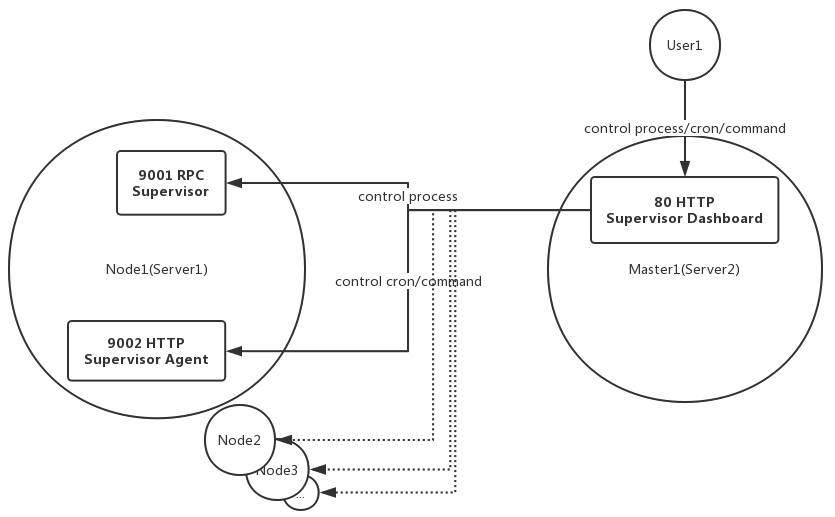

# Supervisor Dashboard

Supervisor 控制台能集中管理服务器上的进程（eg. task/worker）、定时任务以及在服务器上执行命令或脚本。

[Live Demo](http://122.51.144.50/process?server_id=87&ip=172.18.0.2&port=9001)

## 功能模块

- 分组管理
- 服务器管理
- 进程管理
- 定时任务管理
- 执行命令

## 适用对象

- 程序开发人员
- 运维工程师

## 前提条件

请先将 supervisor-agent 安装到每一台需要管理的服务器节点上。



## 项目依赖

- [supervisor-agent](https://github.com/aisuhua/supervisor-agent) 这个项目必须先部署到每一台节点服务器上
- PHP 7.0+
- Phalcon Framework 3.4+
- MySQL 5.6+
- Nginx

Phalcon 是一个全栈式、灵活性高和耦合度低的框架，简单明了的结构让开发变得简单。
另外该项目并没有套用一些最佳实践，只是希望简单问题简单处理，所以如果你看到一些非主流做法，请不要惊讶。
如果你有更好的想法，十分希望您能跟我分享，谢谢～

## 安装

PHP 环境安装参考：https://github.com/aisuhua/wiki/tree/master/php

## 初始化

设置目录可写

```
chmod -R u+w app/cache/metadata app/cache/volt app/log
```

添加 Nginx 配置

```
# resources/nginx/nginx.conf
server {
    listen        80;
    server_name   www.domain.com;

    root /path/to/supervisor-dashboard/public;
    index index.php index.html index.htm;

    charset utf-8;
    client_max_body_size 100M;
    fastcgi_read_timeout 1800;

    location / {
        try_files $uri $uri/ /index.php?_url=$uri&$args;
    }

    location ~ [^/]\.php(/|$) {
        fastcgi_pass  127.0.0.1:9000;

        fastcgi_index /index.php;

        include fastcgi_params;
        fastcgi_split_path_info ^(.+?\.php)(/.*)$;
        if (!-f $document_root$fastcgi_script_name) {
            return 404;
        }

        fastcgi_param PATH_INFO       $fastcgi_path_info;
        fastcgi_param SCRIPT_FILENAME $document_root$fastcgi_script_name;
    }

    location ~ /\.ht {
        deny all;
    }

    location ~* \.(js|css|png|jpg|jpeg|gif|ico)$ {
        expires       max;
        log_not_found off;
        access_log    off;
    }
}
```

创建数据库

```
# resources/mysql/supervisor_dashboard.sql
mysqladmin -u username -ppassword create supervisor_dashboard
mysql -u username -ppassword supervisor_dashboard < supervisor_dashboard.sql  
```

## 使用

添加分组 > 添加服务器 > 添加进程 / 添加定时任务 / 执行命令
